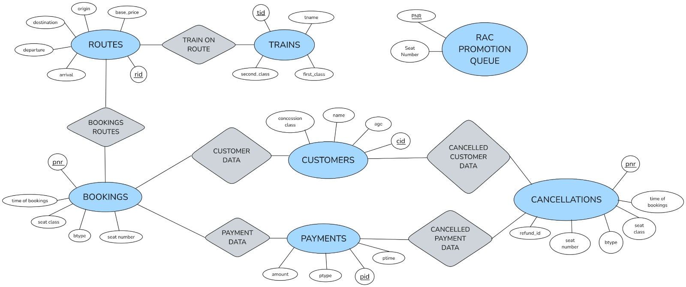

# Train Reservation System Database Documentation

## ER Diagram

## Schema Documentation

This section documents the database tables and their structure.

### Tables

#### Trains
- **Attributes**: `tid` (PK, auto_increment), `tname`, `first_class`, `second_class`
- **Description**: Stores information about trains including their unique ID, name, and number of seats available in first and second class.

#### Routes
- **Attributes**: `rid` (PK, auto_increment), `tid` (FK), `origin`, `dest`, `departure`, `arrival`, `base_price`
- **Description**: Contains route information for trains including origin/destination cities, departure/arrival times, and base ticket price.

#### Customers
- **Attributes**: `cid` (PK, auto_increment), `cname`, `concession_class`, `age`
- **Description**: Stores customer information including name, age, and eligibility for fare concessions (like senior citizen).

#### Payments
- **Attributes**: `pid` (PK), `ptype`, `amount`, `ptime`
- **Description**: Records payment transactions with payment ID, payment method, amount paid, and timestamp.

#### Bookings
- **Attributes**: `pnr` (PK, auto_increment), `cid` (FK), `pid` (FK), `btype`, `seat_class`, `seat_number`, `time_of_booking`
- **Description**: Stores ticket booking details with PNR number, customer reference, booking type (normal/RAC), seat information, and timestamp.

#### BookingsRoutes
- **Attributes**: `pnr`, `rid` (FK)
- **Description**: Junction table linking bookings to routes, allowing tickets to include multiple route segments.

#### Cancellations
- **Attributes**: Same as Bookings plus `refund_id`
- **Description**: Records cancelled bookings with similar fields as Bookings plus additional refund tracking information.

#### RACPromotionQueue
- **Attributes**: `pnr`, `seat_number`
- **Description**: Temporary table used to manage waiting list promotions when seats become available through cancellations.

## Queries Documentation

This section documents the stored procedures, functions, and triggers.

### Procedures

#### QueryPNRStatus
- **Signature**: `QueryPNRStatus(IN _pnr INT)`
- **Description**: Retrieves the status of a booking by PNR number, showing customer name, train name, seat details, and booking status.

#### TrainScheduleLookup
- **Signature**: `TrainScheduleLookup(IN _tid INT)`
- **Description**: Displays the complete schedule for a specific train, including all origins, destinations, and timing details.

#### TrainDateQuery
- **Signature**: `TrainDateQuery(IN train_id INT, IN d DATE)`
- **Description**: Lists all passengers traveling on a specific train on a given date, useful for generating passenger manifests.

#### QueryRACCustomers
- **Signature**: `QueryRACCustomers(IN _tid INT)`
- **Description**: Retrieves all waitlisted (RAC) passengers for a particular train, helping to manage the waiting list.

#### PeriodRevenue
- **Signature**: `PeriodRevenue(IN s DATE, IN e DATE)`
- **Description**: Calculates total revenue from ticket bookings over a specified date range for financial reporting.

#### QueryCancellations
- **Signature**: `QueryCancellations(IN refunded BOOL)`
- **Description**: Retrieves cancellation records filtered by refund status, supporting refund processing workflows.

#### GenItemizedBill
- **Signature**: `GenItemizedBill(IN _cid INT, IN _rid INT, IN _seat_class VARCHAR(40))`
- **Description**: Generates a detailed bill for a ticket including base price and applicable discounts based on seat class and concession status.

#### FindDirectRoutes
- **Signature**: `FindDirectRoutes(IN city1 VARCHAR(40), IN city2 VARCHAR(40))`
- **Description**: Lists all direct train routes between two specified cities to assist with travel planning.

#### CreateBooking
- **Signature**: `CreateBooking(IN _cid INT, IN _pid VARCHAR(40), IN _ptype VARCHAR(40), IN _amount INT, IN _btype VARCHAR(40), IN _seat_class VARCHAR(40), IN _seat_number VARCHAR(40))`
- **Description**: Creates a new booking record with payment information and returns the generated PNR number.

#### InsertBookingRoute
- **Signature**: `InsertBookingRoute(IN _pnr INT, IN _rid INT)`
- **Description**: Associates a booking with a specific route, supporting multi-leg journeys.

#### InsertTrain
- **Signature**: `InsertTrain(IN _tname VARCHAR(40), IN _first_class INT, IN _second_class INT)`
- **Description**: Adds a new train to the system with name and seat capacity information for different classes.

#### InsertCustomer
- **Signature**: `InsertCustomer(IN _cname VARCHAR(40), IN _concession_class VARCHAR(40), IN _age INT)`
- **Description**: Registers a new customer with name, age, and concession eligibility details.

#### InsertRoute
- **Signature**: `InsertRoute(IN _tid INT, IN _origin VARCHAR(40), IN _dest VARCHAR(40), IN _departure DATETIME, IN _arrival DATETIME, IN _base_price INT)`
- **Description**: Creates a new route entry with train ID, location information, timing, and base pricing details.

### Functions

#### AvailableSeatQuery
- **Signature**: `AvailableSeatQuery(routeid INT, seat_num INT)`
- **Description**: Checks if a specific seat is available on a given route, returning 1 if available, 0 if occupied.

#### GetTrainCancelTotalRefund
- **Signature**: `GetTrainCancelTotalRefund(_tid INT)`
- **Description**: Calculates the total refund amount required when cancelling an entire train service.

#### BusiestRoute
- **Signature**: `BusiestRoute()`
- **Description**: Identifies the route with the highest number of booked passengers, useful for capacity planning.

#### GetClassNumAvailableSeats
- **Signature**: `GetClassNumAvailableSeats(_rid INT, _seat_class VARCHAR(40))`
- **Description**: Returns the number of available seats for a specific class on a given route.

### Triggers

#### AfterBookingsDelete
- **Description**: Activates when bookings are deleted, moving them to the Cancellations table and handling RAC promotions.
- **Functionality**: Manages refund eligibility based on cancellation timing and promotes waitlisted tickets when seats become available.

## Normalization

This section evaluates the normalization levels of each table in the database schema.

## Normalization Analysis by Table

### Trains
- **1NF**: ✅ All attributes are atomic and table has a primary key (`tid`).
- **2NF**: ✅ All non-key attributes (`tname`, `first_class`, `second_class`) are fully dependent on the primary key.
- **3NF**: ✅ No transitive dependencies exist; all attributes directly depend on the primary key.
- **BCNF**: ✅ Every determinant is a candidate key.

### Routes
- **1NF**: ✅ All attributes are atomic and table has a primary key (`rid`).
- **2NF**: ✅ All non-key attributes fully depend on the primary key.
- **3NF**: ✅ No obvious transitive dependencies.
- **BCNF**: ✅ Every determinant is a candidate key.

### Customers
- **1NF**: ✅ All attributes are atomic and table has a primary key (`cid`).
- **2NF**: ✅ All non-key attributes (`cname`, `concession_class`, `age`) fully depend on the primary key.
- **3NF**: ✅ No transitive dependencies exist.
- **BCNF**: ✅ Every determinant is a candidate key.

### Payments
- **1NF**: ✅ All attributes are atomic and table has a primary key (`pid`).
- **2NF**: ✅ All non-key attributes fully depend on the primary key.
- **3NF**: ✅ No transitive dependencies exist.
- **BCNF**: ✅ Every determinant is a candidate key.

### Bookings
- **1NF**: ✅ All attributes are atomic and table has a primary key (`pnr`).
- **2NF**: ✅ All non-key attributes fully depend on the primary key.
- **3NF**: ✅ No obvious transitive dependencies, as cid and pid are foreign keys representing relationships rather than transitive dependencies.
- **BCNF**: ✅ Every determinant is a candidate key.

### BookingsRoutes
- **1NF**: ✅ All attributes are atomic.
- **2NF**: ✅ This is a junction table linking bookings to routes with no non-key attributes.
- **3NF**: ✅ No non-key attributes means no transitive dependencies.
- **BCNF**: ✅ The combination of pnr and rid effectively forms the primary key.

### Cancellations
- **1NF**: ✅ All attributes are atomic and table has a primary key (`pnr`).
- **2NF**: ✅ All non-key attributes fully depend on the primary key.
- **3NF**: ✅ No transitive dependencies.
- **BCNF**: ✅ Every determinant is a candidate key.

### RACPromotionQueue
- **1NF**: ✅ All attributes are atomic and table has a primary key (`pnr`).
- **2NF**: ✅ This is a temporary queue table with just two fields where seat_number depends on pnr.
- **3NF**: ✅ No transitive dependencies.
- **BCNF**: ✅ Every determinant is a candidate key.
